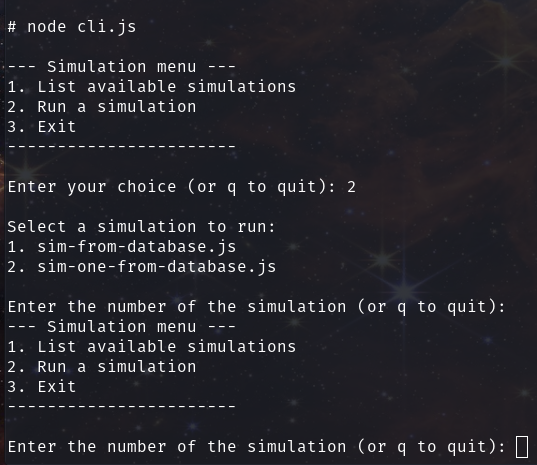

# Simulation

## Get started

Get the system running by entering

`docker-compose up --build`

in the terminal (this is the Docker Compose tab).

Make note of the container name for the simulation container. For me it's *'project_simulation_1'*.

In a second terminal window or tab (the simulation container tab), enter:

`docker exec -it <sim-container-name> sh`

You should now have a prompt, `#`.

Enter:

`node cli.js`

to access the simulation menu. To start a simulation, enter '2', press enter, and then select one of the listed simulations, and press enter.

The simulation output should now be visible in the Docker Compose tab.

The simulation can be stopped by using ctrl + c in the simulation container tab. (For the time being, this also closes the client, but it can easily be started again with `node cli.js`).

To exit the simulation container, enter

`exit`

and press enter.
